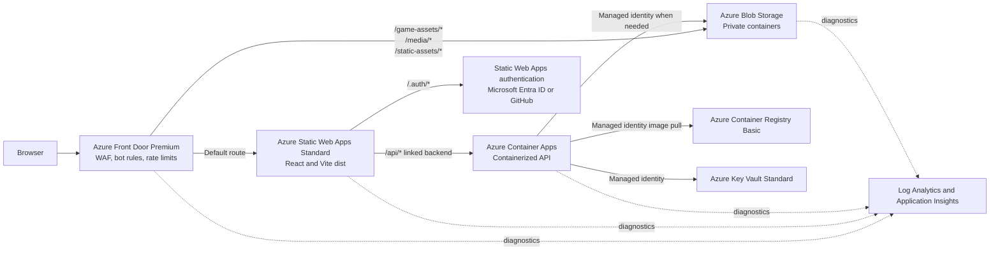

# Azure Hosting Infrastructure

This document resolves the baseline Azure topology for Game Hub. It is the
design input for the Bicep implementation tracked by GitHub issue #1.

> **Evidence boundary:** This is an architecture decision, not deployment
> evidence. No Azure resources, frontend, container image, asset, authentication
> flow, or public endpoint were deployed or verified by this story.

## Deployment Scope

Every deployment must explicitly select Azure subscription
`11213dbd-39fe-46ba-87db-5f5e8c449aed`. The baseline uses:

- one resource group per environment;
- `eastus2` as the initial regional location;
- Azure Front Door and its web application firewall (WAF) in their required
  global location;
- separate `dev` and `prod` resource instances rather than shared mutable
  application resources; and
- subscription-scope Bicep as the only supported resource creation path.

`eastus2` is the initial single-region default because it supports the selected
regional services and Azure Front Door Private Link. It remains a parameter,
not an application assumption. Multi-region application origins are a future
availability enhancement, not part of the baseline.

The full development topology is intended to be deployed on demand rather than
kept running continuously. Production resources are persistent. This preserves
topology parity without making the comparatively expensive public edge a
permanent development cost.

## Selected Topology

Azure Front Door is the only canonical public endpoint. Its routes are ordered
so the three blob content prefixes go to the storage origin and all remaining
paths go to Azure Static Web Apps. Azure Static Web Apps then proxies `/api/*`
to its linked Azure Container Apps backend. The browser therefore uses one
stable origin:

| Public contract | Destination |
| --- | --- |
| `https://<front-door-host>/*` | Azure Static Web Apps |
| `https://<front-door-host>/.auth/*` | Azure Static Web Apps authentication |
| `https://<front-door-host>/api/*` | Linked Azure Container Apps backend |
| `https://<front-door-host>/game-assets/*` | Blob container `game-assets` |
| `https://<front-door-host>/media/*` | Blob container `media` |
| `https://<front-door-host>/static-assets/*` | Blob container `static-assets` |

The blob prefixes deliberately avoid `/assets/*`, which Vite already uses for
the website's generated application bundles.

### Public ingress boundary

Azure Front Door Premium is selected instead of Standard because the baseline
requires both the managed bot protection rule set and Private Link to the blob
origin. One WAF security policy covers the canonical frontend, authentication,
API, and content routes.

The WAF starts in detection mode during a new environment's tuning window and
must move to prevention mode before that environment is considered
production-ready. The policy includes:

- the current supported Azure-managed default rule set;
- the current supported managed bot rule set;
- separate rate-limit rules for `/api/*`, `/.auth/*`, and general traffic; and
- diagnostics for managed-rule and custom-rule matches.

Rate-limit thresholds remain environment parameters because they require
traffic evidence. Azure Front Door rate limits are per socket IP address and
can admit some traffic above very low thresholds, so production values must be
calibrated rather than presented as exact security boundaries.

Azure Front Door must not cache `/.auth/*`, `/api/*`, or any route marked
authenticated. Hashed frontend files and immutable game assets receive long
cache lifetimes. Mutable media and non-hashed files receive shorter,
environment-aware lifetimes.

### Frontend and authentication boundary

Azure Static Web Apps Standard hosts the existing `dist/` output. Standard is
required because linking an Azure Container Apps backend is not available on
the Free plan. It also leaves a path to custom authentication provider
registrations and a service-level agreement without changing hosting services.

The initial authentication integration is the built-in Azure Static Web Apps
authentication surface:

- Microsoft Entra ID and GitHub are available as preconfigured providers;
- `staticwebapp.config.json` owns route-level role requirements;
- `/.auth/me` is the frontend identity contract; and
- a future custom Microsoft Entra ID registration can replace the
  preconfigured provider without replacing the frontend, API, or edge.

The API is linked to the static web app rather than exposed as a separate
browser origin. Azure Static Web Apps proxies the complete `/api` path and
configures the Container App with the `Azure Static Web Apps (Linked)` identity
provider so the container accepts linked proxy traffic by default. API code
must still authorize operations and must not trust a client-supplied identity
header outside that protected proxy boundary.

Azure Static Web Apps pull-request environments do not support linked backends.
End-to-end frontend-to-API validation therefore runs against the deployed
development environment, while pull-request environments remain suitable for
frontend-only review.

Azure Front Door Private Link does not support Azure Static Web Apps as an
origin. Instead, the static web app is restricted to the
`AzureFrontDoor.Backend` service tag and requires the deployment's
`X-Azure-FDID` forwarding header and allowed Front Door hosts. This prevents the
generated `*.azurestaticapps.net` hostname from bypassing the canonical WAF
path.

### API and container registry boundary

Azure Container Apps hosts the future Docker-based API in a consumption
workload profile. HTTP scaling and explicit replica limits provide a bounded
serverless starting point:

| Environment | Minimum replicas | Initial maximum | Starting allocation |
| --- | ---: | ---: | --- |
| `dev` | 0 | 2 | 0.25 vCPU, 0.5 GiB |
| `prod` | 1 | 5 | 0.5 vCPU, 1 GiB |

These are safe budget defaults, not capacity evidence. Production keeps one
warm replica to avoid user-facing cold starts; development can scale to zero.
Load and latency telemetry determine later changes.

Azure Container Registry Basic is the initial private registry because the
expected image count and deployment concurrency are low. A user-assigned
managed identity receives only the `AcrPull` role and is used by Container Apps
for image pulls. Registry administrative credentials and anonymous pulls stay
disabled.

Basic registry networking remains public because private endpoints require the
Premium registry tier. Upgrade to Premium only when private registry ingress,
geo-replication, or measured image throughput requires it. This is an explicit
cost-versus-network-isolation tradeoff; authentication still uses Microsoft
Entra role-based access control rather than registry passwords.

### Asset boundary

A general-purpose v2 storage account provides three private blob containers:

- `game-assets` for independently packaged game content;
- `media` for user-facing images and media; and
- `static-assets` for other non-application static files.

Anonymous blob access is disabled at the account level. Azure Front Door
Premium reaches the blob service through Private Link, and clients receive only
the Front Door URLs. Upload automation uses Microsoft Entra role-based access
control with `Storage Blob Data Contributor` scoped as narrowly as the
publisher permits; it does not use account keys.

The Bicep deployment must also make the Front Door managed private endpoint
approval repeatable. A pending manual portal approval is not an acceptable
finished deployment.

Development starts with locally redundant storage. Production starts with
zone-redundant storage in `eastus2`. Geo-redundancy is deferred until recovery
objectives justify its replication and egress costs.

### Secrets and management boundary

Azure Key Vault Standard stores runtime secrets that cannot be replaced by
managed identity. Container Apps accesses only named secrets through managed
identity and least-privilege Key Vault roles. Secret values are supplied by a
trusted deployment identity and are never committed, emitted as Bicep outputs,
or passed as plain command-line parameters.

GitHub Actions deployment later uses OpenID Connect federation to Azure rather
than a long-lived client secret. Separate deployment identities and resource
groups keep development and production permissions distinct. The infrastructure
deployment identity receives only the control-plane and role-assignment
permissions required by the declared resources.

## Environment Strategy

Both environments use the same modules and route topology. Parameters change
capacity, retention, resilience, WAF rollout mode, and resource names.

| Decision | `dev` | `prod` |
| --- | --- | --- |
| Lifecycle | On-demand full stack | Persistent |
| Azure Front Door | Premium; detection while tuning | Premium; prevention required |
| Static Web Apps | Standard | Standard |
| Container Apps | Scale to zero, bounded at 2 | One warm replica, bounded initially at 5 |
| Container Registry | Basic | Basic; upgrade on measured need |
| Blob redundancy | Locally redundant | Zone redundant |
| Log retention | 30 days | 30 days initially; increase only for an approved need |
| WAF thresholds | Higher tolerance for test traffic | Calibrated from production telemetry |
| Resource sharing | None with production | None with development |

Each deployment carries environment, application, owner, and cost-center tags.
Azure Cost Management budgets and alerts are environment scoped. Deleting the
development resource group is the supported cleanup operation; shared
cross-environment data must not be placed in it.

## Cost Topology and Tradeoffs

Exact prices vary by agreement, region, traffic, and date, so the deployment
documentation must use the Azure pricing calculator before production approval
rather than commit a misleading dollar total.

| Service | Cost shape | Baseline control |
| --- | --- | --- |
| Azure Front Door Premium and WAF | Dominant fixed profile charge plus requests and data transfer | Deploy development on demand; use one profile per environment for isolation |
| Azure Static Web Apps Standard | Fixed plan charge plus plan limits and overages | One app per environment; use staging environments for frontend-only review |
| Azure Container Apps | vCPU, memory, requests, and log volume | Scale development to zero; cap replicas in every environment |
| Azure Container Registry Basic | Daily registry charge plus excess storage and transfer | Basic tier, image cleanup policy in deployment automation |
| Blob Storage and Private Link | Stored bytes, operations, transfer, and private endpoint processing | LRS in development, ZRS in production, lifecycle policies for stale content |
| Key Vault Standard | Operations and optional premium key features | Store only required secrets; prefer managed identity |
| Log Analytics and Application Insights | Ingested data and retention | Sampling, 30-day baseline retention, explicit daily caps and alerts |

Front Door Premium is intentionally the largest baseline commitment. Replacing
it with Standard would remove managed bot protection and private blob-origin
connectivity, while separate edge products would duplicate routing and
certificate operations. The Premium choice buys one protected canonical
endpoint and origin isolation.

The initial topology is single-region and does not promise regional failover.
Adding a second Container Apps environment or storage origin would increase
availability and cost and requires an explicit recovery objective first.

## Operations and Observability

The baseline includes a Log Analytics workspace and workspace-based Application
Insights resource per environment. Diagnostic settings collect:

- Azure Front Door access, health probe, and WAF logs;
- Container Apps system and application console logs;
- blob transaction and authentication diagnostics;
- Key Vault audit events.

Azure activity logs and continuous deployment logs retain control-plane
deployment evidence separately from resource diagnostics.

Alerts cover repeated WAF blocks, API error rate and latency, zero healthy API
replicas, failed container revisions, storage authorization failures, and
budget thresholds. Alert recipients are deployment parameters, not hard-coded
personal addresses.

Immutable assets use content-hashed names. Deployments purge only changed
mutable Front Door paths. Health probes use a lightweight unauthenticated API
health route that reveals no dependency or secret details.

## Deployment Shape and Outputs

The later Bicep entry point must be subscription scoped so it can create the
environment resource group and all child resources declaratively. A repeated
deployment with the same parameters must converge. The expected order is:

1. resource group, monitoring, and identities;
2. storage, Key Vault, registry, and Container Apps environment;
3. Container App, Static Web App, and linked API backend;
4. Front Door routes, WAF policy, and blob Private Link approval; and
5. Static Web Apps forwarding-gateway restrictions using the Front Door ID.

Deployment outputs expose non-secret application and automation contracts:

- canonical Front Door endpoint and resource ID;
- frontend resource name and generated hostname for diagnostics;
- stable public API base URL ending in `/api`;
- public content base URLs for all three blob categories;
- Static Web App and Container App resource IDs;
- Container App diagnostic fully qualified domain name;
- registry resource ID and login server;
- storage account resource ID, blob endpoint, and container names;
- Key Vault URI, never secret values;
- managed identity resource IDs and principal IDs;
- Log Analytics workspace and Application Insights resource IDs; and
- authentication mode, provider login paths, and non-secret client identifiers
  when custom authentication is enabled.

Storage keys, registry credentials, deployment tokens, provider secrets, and
connection strings are forbidden outputs.

Every preview and deployment command must select subscription
`11213dbd-39fe-46ba-87db-5f5e8c449aed` explicitly before running Bicep
validation, `what-if`, or deployment.

## Requirement Traceability

| Issue requirement | Baseline decision | Implementation story |
| --- | --- | --- |
| Organize resources with Bicep modules | Subscription entry point and bounded service modules | US-002 |
| Host the static frontend | Azure Static Web Apps Standard behind Front Door | US-003 |
| Support website authentication | Static Web Apps authentication and route roles | US-006 |
| Host a Docker-based API | Linked Azure Container Apps backend and Azure Container Registry | US-004 |
| Store game assets and media | Private general-purpose v2 blob storage containers | US-005 |
| Put content delivery in front of assets | Front Door Premium blob routes over Private Link | US-005 |
| Protect against bots and abusive traffic | Front Door Premium WAF managed bot and rate-limit rules | US-007 |
| Keep configuration environment aware | Separate resource groups and shared modules with explicit parameters | US-002 and US-008 |
| Expose deployment configuration | Non-secret service, endpoint, identity, and monitoring outputs | US-002 through US-008 |
| Avoid committed secrets | Managed identity, Key Vault, and federated deployment identity | US-008 |
| Make deployment repeatable | Idempotent Bicep, declarative Private Link approval, and documented `what-if` | US-002 and US-009 |

## Alternatives Not Selected

- **Static website hosting in Blob Storage:** cheaper, but loses the selected
  Static Web Apps authentication and linked API boundary.
- **Azure Static Web Apps Free:** cannot link the Container Apps backend and
  has no production service-level agreement.
- **Direct browser access to Container Apps:** introduces a second public
  origin and a separate authentication and cross-origin resource sharing
  boundary.
- **Azure Front Door Standard:** supports custom rate limiting but not the
  selected managed bot rule set or Private Link origin protection.
- **Azure Kubernetes Service:** adds cluster operations and idle capacity before
  the API requires that control.
- **Azure Container Registry Premium:** provides private endpoints and
  geo-replication, but its fixed cost is not justified by the baseline image
  volume.
- **A shared development and production resource group:** lowers resource
  count but weakens deletion safety, permissions, budgets, and blast-radius
  isolation.

## Authoritative References

- [Azure Static Web Apps hosting plans](https://learn.microsoft.com/azure/static-web-apps/plans)
- [Azure Static Web Apps authentication and authorization](https://learn.microsoft.com/azure/static-web-apps/authentication-authorization)
- [Link Azure Container Apps as a Static Web Apps API](https://learn.microsoft.com/azure/static-web-apps/apis-container-apps)
- [Configure Azure Front Door manually for Static Web Apps](https://learn.microsoft.com/azure/static-web-apps/front-door-manual?pivots=swa-afd-manual-afd)
- [Azure Front Door Private Link origins](https://learn.microsoft.com/azure/frontdoor/private-link)
- [Azure Front Door WAF bot protection](https://learn.microsoft.com/azure/web-application-firewall/afds/waf-front-door-policy-configure-bot-protection)
- [Azure Front Door WAF rate limiting](https://learn.microsoft.com/azure/web-application-firewall/afds/waf-front-door-rate-limit)
- [Azure Container Apps scaling](https://learn.microsoft.com/azure/container-apps/scale-app)
- [Managed identity image pulls from Azure Container Registry](https://learn.microsoft.com/azure/container-apps/managed-identity-image-pull)
- [Azure Container Registry service tiers](https://learn.microsoft.com/azure/container-registry/container-registry-skus)
- [Prevent anonymous Blob Storage access](https://learn.microsoft.com/azure/storage/blobs/anonymous-read-access-prevent)
